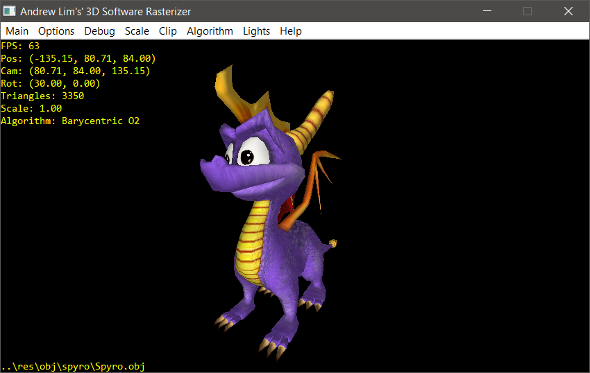
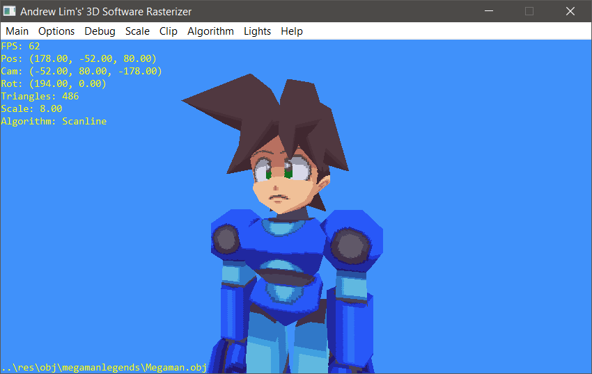

# Andrew Lim's C++ 3D Software Rasterizer

Personal 3D playground program for me to test and learn 3D rendering. Source code made public in case somebody finds it helpful.
Though it is a still a very much work in progress.

You will need a C++ 11 compiler. Currently I'm developing with [Embarcadero Dev-C++](https://github.com/Embarcadero/Dev-Cpp)

All rendering is done first on a custom [ImageData](src/ImageData.h) object which holds a one-dimensional array of bytes (of type uint8_t).
Then the bytes are transferred/blitted to the native screen format. In this case, I'm testing with Win32 GDI where the bytes are
displayed with [SetDIBitsToDevice](https://learn.microsoft.com/en-us/windows/win32/api/wingdi/nf-wingdi-setdibitstodevice).

[Download Latest Release Here](https://github.com/andrew-lim/sw3dcpp/releases/).

## Screenshots
<table style="padding:10px">
  <tr>
    <td width="50%"></td>
    <td width="50%"></td>
  </tr>
  <tr>
    <td width="50%"></td>
    <td width="50%"></td>
  </tr>
</table>

## Videos

[YouTube Playlist](https://www.youtube.com/watch?v=YPubnjG4eH8&list=PL4Pn9mFG1hxREHDD_Zxq7BTCi5jRkjrjr&ab_channel=AndrewLim)

## Features

- 4 triangle rendering algorithms: standard scanline, barycentric, and 2 optimized barycentric variants
- Displays a simple textured cube at the start
- Loading .OBJ and .MTL files with BMP/PNG support. Sample models can be loaded from the Debug menu
- Solid, Affine and Nearest Neighbour Perspective-Correct Texture Mapping
- Clipping by near plane only, or clipping by all 6 planes
- Z Buffer
- Flat and Smooth/Gourand Lighting

## Libraries Used

- [lodepng](https://github.com/lvandeve/lodepng) for PNG loading
- [tinyobjloader](https://github.com/tinyobjloader/tinyobjloader) for .OBJ parsing
- [glm](https://github.com/g-truc/glm) was previously used for matrix math but has been replaced by custom Matrix and Vector classes. However it is still distributed together with the source code.

MIT Licensed
