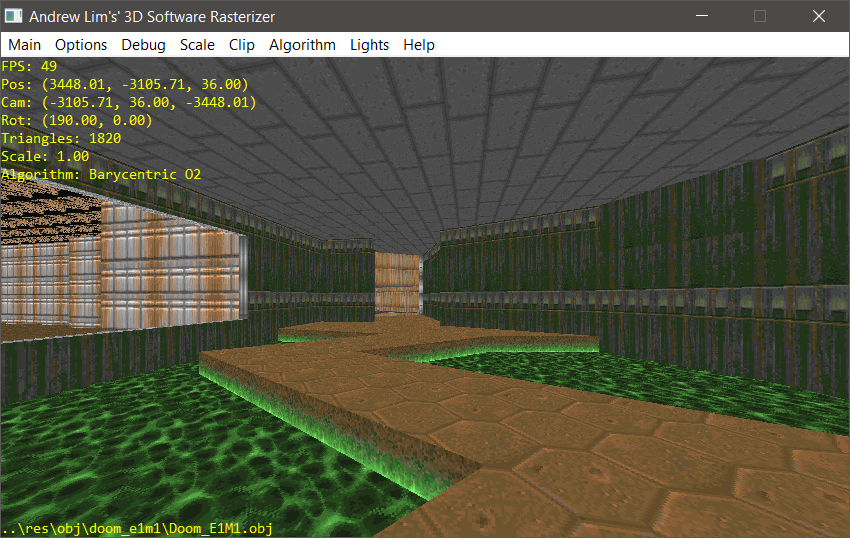

# Andrew Lim's C++ 3D Software Rasterizer

Personal 3D playground program for me to test and learn 3D rendering. Source code made public in case somebody finds it helpful.
You will need a C++ 11 compiler. Currently I'm developing with [Embarcadero Dev-C++](https://github.com/Embarcadero/Dev-Cpp)

All rendering is done first on a custom ImageData class which just holds a 2D array of bytes (aka std::uint8_t).
Then the bytes are transferred/blitted to the native screen format. In this case, I'm testing with Win32 GDI where the bytes are
displayed with [SetDIBitsToDevice](https://learn.microsoft.com/en-us/windows/win32/api/wingdi/nf-wingdi-setdibitstodevice).

## Screenshots
<table style="padding:10px">
  <tr>
    <td width="50%"></td>
    <td width="50%"></td>
  </tr>
  <tr>
    <td width="50%"></td>
    <td width="50%"></td>
  </tr>
</table>

## Features

- Displays a simple textured cube at the start
- Loading .OBJ and .MTL files with BMP/PNG support
- Solid, Affine and Nearest Neighbour Perspective-Correct Texture Mapping
- Clipping by near plane only, or clipping by all 6 planes
- Z Buffer

## Libraries Used

- [glm](https://github.com/g-truc/glm) for matrix math
- [lodepng](https://github.com/lvandeve/lodepng) for PNG loading
- [tinyobjloader(https://github.com/tinyobjloader/tinyobjloader) for .OBJ parsing

MIT Licensed
